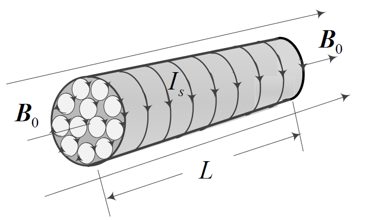

# 真空中的磁场
## 1 恒定电流
### 1.1 电流形成的条件
- 导体内存在 **自由** 电荷
- 导体两端有电势差
### 1.2 电流强度的定义
单位时间内通过 **导体横截面** 的电量，一定要注意，这里如果选取的 **横截面积不同**，就会导致电流的大小不同。
$$
I = \frac{dq}{dt}\\
$$
### 1.3 电流密度的定义
通过垂直电流方向上单位截面积的电流。
$$
\begin{align}
\vec j &= \frac{dI}{dS}\vec {e_0}\\
dI &= \vec j \cdot\vec{dS}\\
I &= \iint_SdI =\iint_S\vec j \cdot\vec{dS}\\
\end{align}
$$
这里对于**电流**的理解就是 **电流密度的通量**。
**特别注意：这里一定是线密度，而不是面密度**    
### 1.4 电流的连续性方程
$$
\unicode{8751}_S \vec j \cdot\vec{dS} = -\frac{dQ_i}{dt}\\
$$
特别注意，由于曲面积分时选择了向外为正方向，因而要注意 **加负号**
### 1.5 电源电动势
$$
E = \int_{B(-)}^{A(+)}\vec{E_K} \cdot\vec {dl}\\
$$
特别注意，这里其实是 **非静电力场在路径上** 的积分，由于其不一定是 **保守场**，因而不一定是与路径无关的。
### 1.6 欧姆定律的微分形式
$$
\vec j = \sigma \vec E\\
$$
其中$\rho = 1/\sigma$。
## 2 毕奥-萨伐尔定律
### 2.1 电流元的定义
目的：用 **积分法** 求任意形状电流的 **磁场分布**
### 2.2 公式
$$
d\vec B =\frac{\mu_0}{4\pi}\frac{Id\vec l \times\vec r}{r^3}\ 或\ 
d B =\frac{\mu_0}{4\pi}\frac{Id l sin\theta}{r^2}
$$
特别注意公式中的 **位置矢量 $\vec r$** 是从 **电流元** 到 **考虑磁场的点** 的，即考虑点相对于电流元的位置。
### 2.3 举例
#### 2.3.1 载流直导线
$$
B = \frac{\mu_0I}{4\pi a}(\cos\theta_1-\cos\theta_2)\\
$$
顺着电流的方向，**起点到目标点** 与电流方向的夹角是 $\theta_1$，**终点到目标点** 与电流方向的夹角是 $\theta_2$.依旧是贯彻“**位置矢量 $\vec r$​** 是从 **电流元** 到 **考虑磁场的点** 的，即考虑点相对于电流元的位置。”的道理。
额外需要注意的是，**千万千万不要把一个有限长的导线，直接代入了无限长导线的公式**
对于 **无限长** 的载流直导线，
$$
B =\frac{\mu_0I}{2\pi a}\\
$$
#### 2.3.2 载流圆线圈轴上
$$
B =\frac{\mu_0IR^2}{2(R^2+x^2)^{\frac 32}}=B_0\cdot \sin^3\varphi\\
$$
对于圆心处，$x = 0$，
$$
B_0 =\frac{\mu_0I}{2R}\\
$$
> [!note]
>
> 跟无限长直导线只差一个$\pi$​
对于圆形电流面积很小或场点距圆电流很远时(称为 **磁偶极子**)，
$$
x \approx r\\
B =\frac{\mu_0I\pi R^2}{2\pi x^3}=\frac{\mu_0IS}{2\pi x^3}\\
$$
#### 2.3.3 载流密绕直螺线管轴线
$$
B =\frac{\mu_0nI}2 [\frac{x_2}{\sqrt{x^2_2+R^2}}-\frac{x_1}{\sqrt{x_1^2+R^2}}]\\
$$
对于无限长直螺线管
$$
x_1 \to -\infty, x_2 \to \infty\\
B =\mu_0nI\\
B=\mu_0j\\
$$
长直螺线管端点处
$$
x_1 \to -\infty, x_2 = 0\\
B =\frac12\mu_0nI\\
B=\frac12\mu_0j\\
$$
#### 2.3.4 运动电荷
$$
\vec B =\frac{\mu_0}{4\pi}\frac{q\vec v\times \vec r}{r^3}\\
$$
其实就是这个定律本身，$I\vec l$ 降级之后就是 $q\vec v$​.

### 2.4 注意
注意上学期经验的运用
- 合适的微元选取
- 对向量向两个方向去分解
### 2.5 磁场的高斯定理和安培环路定理

#### 2.5.1 高斯定理
由于磁感线是没有起止点的闭合曲线，所以通过任意闭合曲面$S$的磁感应线，穿进的数目必定等于穿出的根数，磁通量恒为 0.
$$
\oiint_S\vec B\cdot d\vec S = 0\\
$$
往往在应用高斯定理时是需要 **补面** 的。
> [!note]
>
> 磁场的高斯定理只能证明这是一个**无源场**，必须还需要因为环路定理得到这是一个**有旋场**，二者合一才能得到这是一个**涡旋场**
#### 2.5.2 安培环路定理
$$
\vec B 沿 l 的环流 =\mu_0 乘 l 所围电流的代数和\\
\oint_l\vec B\cdot d\vec l =\mu_0\sum I_i\\
$$
$I $流向与$ l$绕向成右手螺旋关系时，$I$为正。$\vec B$ 的环流不为 0，表面磁场是有旋场，非保守场（**无磁势能**）。
特别注意
- 磁感应强度和它的环流是两个概念，后者只取决于 **L 所包围的电流强度** 的代数和，而前者则是由 **L 内外的电流共同产生** 的。
- 安培环路定理只适用于 **稳恒电流** 的情况
- 利用安培环路定理可以计算具有 **高度对称性分布磁场** 的磁感应强度。
    - 长电流（线、柱）
    - 无限长直螺线管
    - 螺绕环
使用步骤
1. 对称性分析
2. 选取回路 L
3. 定回路取向，判断包围电流正负
4. 根据公式进行计算
##### 2.5.2.1 载流密绕长直螺线管
$$
B =\mu_0nI\\
B =\mu_0j\\
$$
需要额外说明的是，通电螺线管外部的磁场 **足够小，接近于 0**，而对于 **无限长的** 通电螺线管外部的磁场为 0.**不要轻易地试图去探究为什么，记住他**。
特别注意这里的 $n$是指 **单位长度** 上电流的匝数，每匝通有电流 $I$。所以其实统一上讲，磁感应强度的大小应该是 $\mu_0$ 乘以 **单位时间内通过螺线管上单位长度的电荷量**。这样这两个公式就是统一的了（不过这里的$j$是单位长度上的电流密度，而不是单位面积上的）。
##### 2.5.2.2 载流密绕螺线环
$$
B =\frac{\mu_0NI}{2\pi r}
$$
##### 2.5.2.3 无限大均匀平面电流
两侧的磁场都为均匀磁场，并且大小相等，方向相反
$$
B =\frac{\mu_0j}{2}
$$
这个似乎是可以和密绕螺线管的公式统一起来~
## 3 磁场对载流导线的作用
### 3.1 安培定律
$$
d\vec F = Id\vec l\times\vec B\\
$$
特别注意，这里的先后顺序，**电流元** 在前，**磁感应强度** 在后。
### 3.2 有限长的载流导线在磁场中的受力
1. 先写出任一电流元受的力(如果没有求出磁感应强度大小，先求磁感应强度大小)
$$
d\vec F = Id\vec l \times\vec B\\
$$
2. 再写出 $d\vec F$ 的三个分量
$$
d\vec F_x, d\vec F_y. d\vec F_z\\
$$
3. 然后分别求出该力的三个分量
$$
F_X =\int_ldF_x, F_y =\int_ldF_y, F_z =\int_ldF_z\\
$$
4. 最后合成
$$
\vec F = F_x \vec i + F_y \vec j+F_z\vec k\\
$$
在 **均匀磁场中有**
$$
\vec F_{\overset{\frown}{MN}}=\vec F_{\overline{MN}}
$$
**任意平面载流导线在均匀磁场中所受的力，与其始点和终点相同的载流直导线所受的磁场力相同**
### 3.3 无限长平行载流直导线之间的相互作用
$$
F=\frac{\mu_0 I_1 I_2}{2\pi d}
$$
## 4 磁场对载流线圈的作用
### 4.1 磁矩
当一个载流回路放在磁场里时，它有受到一个趋势：**线圈想转到磁通量最大的方向**。描述这种“旋转能力”的物理量叫做**磁矩**。
$$
\vec m = IS\vec e_n
$$
特别注意，其方向是对电流的 **右手螺旋** 方向。单位：$A \cdot m^2$。
对于 N 匝线圈有
$$
\vec m = NIS\vec e_n\\
$$
单位：$A\cdot m^2 \cdot T=N\cdot m$。
> [!note]
>
> 所以其实知道磁矩就可以推导出磁感应强度了，注意好这二者的联系
### 4.2 磁力矩
简单来说，就是磁力导致的力矩。**均匀磁场中载流线圈所受磁力为 0**
$$
\vec M = NIS\vec e_n\times \vec B = \vec m \times \vec B\\
\vec m = NIS\vec e_n
$$
对于**微分形式**下，有：
$$
m=\int dm=\int Sdi\\
M=\int Bdm=\int BS di\\
$$
> [!note]
>
> 磁矩和**磁化强度**也有关系。$M=\frac{\sum p_{分子}}{\Delta V}$
### 4.3 磁力和磁力矩的功
这二者在做功上是 **统一** 的，一个是由 **移动** 产生的，一个是由 **旋转** 产生的。
#### 4.3.1 磁力做功
$$
A = F\overline{aa'}= IlB\overline{aa'}= IB\Delta S = I\Delta\Phi\\
$$
#### 4.3.2 磁力矩做功
$$
dA =\vec M\cdot d\vec\varphi = NId\Phi\\
A =\int dA =\int_{\Phi_1}^{\Phi_2}NId\Phi = NI\Delta\Phi\\
$$
总而言之，磁场力和磁力矩的功可以统一为：$A=NI\Delta \Phi$。
永远记住 **力矩** 求 **做功** 时是 **对角度** 积分。
> [!note]
>
> 这里特别要注意好，角度$\varphi$的正负的确定方式：**逆时针为正，顺时针为负**，$d\varphi$方向的判断是靠的右手螺旋。
>
> 转动的方向怎么定义呢？这时就用 **右手定则**：
>
> - 右手四指按转动方向弯曲；
> - 拇指所指的方向就是角位移矢量的方向。
>
> 举个例子：
>
> - 如果一个轮子逆时针旋转（从你面前看），那么角位移矢量就指向**你眼睛的方向**。
> - 如果顺时针旋转，就指向**远离你**的方向。
## 5 磁场对运动电荷的作用
### 5.1 洛伦兹力
$$
\vec F = q\vec v \times \vec B\\
$$
### 5.2 带电粒子在均匀磁场中的运动
高中知识
### 5.3 霍尔效应
$$
U_{霍尔}= V_1-V_2 = R_H\frac{IB}d\\
霍耳系数：R_H =\frac 1{nq}\\
p 型半导体（空穴导电）: R_H > 0\\
n 型半导体（电子导电）：R_H < 0\\
$$
## 6 做题笔记
### 6.1 求电流/电流密度
#### 6.1.1 方法一
1. 用 $dR=\rho\frac{dr}{dS}$ 求 $dR$，记得别求错 $dS$
2. 积分求出 $R$
3. 欧姆定律求出电流
4. 用 $j=\frac{I}{S}$ 得到电流密度
#### 6.1.2 方法二
1. 假设带电量为 $Q$ 和 $-Q$
2. 用 $E=\frac{Q}{4\pi\epsilon_0\epsilon_rr^2}$ 表示出两者之间的电场强度
3. 由 $U=\int_{R_1}^{R_2}E\cdot dr$​，建立起等式，表示出 $Q$
4. 用 $j=\sigma E$ 求出电流密度
5. 用 $I=\iint_S\vec j\cdot d\vec S$​ 求出电流
#### 6.1.3 方法三
1. 用$\oint _L\vec E_B\cdot d\vec r=-\frac{d\Phi}{dt}$求$E_B$
2. 用$j=\sigma E_B$求$j$
### 6.2 求磁感应强度
#### 6.2.1 方法一
1. 如果该点在导线的延长线上，则该导线对其贡献为 0
2. 用 $B=\frac{\mu_0I}{4\pi r_0}(\cos\alpha_1-\cos\alpha_2)$ 求出磁感应强度，特别注意好 **几何关系** 的问题（沿着电流方向，起点对应 $\alpha_1$，终点对应 $\alpha_2$​）
3. 注意好矢量叠加时要注意方向
#### 6.2.2 方法二
对于 **对称性高的结构**，选定合适的闭合回路，利用 **安培环路定理** $\int_LB\cdot dl=\mu_0\sum I$​即可。
不过要特别注意的是，这里是 **磁感应强度的环流** 与所围区域内 **电流** 的关系，某个区域内没有电流，只能说明 **该区域的磁感应强度的环流值** 为 0，而 **不能说明该区域的磁感应强度为 0**。
### 6.3 密度微元的选取问题
对于要考虑匝数的问题中，常常要选取微元变量来分析问题，额外需要注意的是，在选取时要保证其 **密度是均匀的**。
例如：

这里在选取密度时，不能选择竖直方向上的 $\lambda=\frac{N}R$，因为这些导线是在 **弧线上** 均匀分布的，而在竖直方向上并不均匀。所以应该是选取弧线上的密度，并在最后对 **角度** 进行积分。即：$n=\frac{N}{\pi R/2}$。
### 6.4 证明某一点附近场是均匀的

从根本上讲，其实是证明一个函数在此处是 **平稳的**。只需要满足
$$
\frac{dB}{dx}= 0\\
\frac{d^2B}{dx^2}= 0\\
$$
即可。（既不是极大值，也不是极小值，但是导数值为 0，则该点附近是场强均匀的。）
需要特别注意的是，在解方程时要注意数学中 **函数的单调性** 的运用，来便于方程的求解。
### 6.5 补偿法与场强叠加原理
本题还用到了矢量叉乘的分析。

- 这个题目在补偿的时候，是选取的 **与原来电流方向相反的电流**。
- 明显需要对场强进行叠加，所以应该使用 **矢量式** 来表达，不过可以采用先用 **安培环路定理** 求出大小，再分析出其方向之后，**改写成矢量式**。
- 额外注意进行矢量叠加时，注意 **向量运算的使用** 和 **方向的判断**。
- 这种题还会涉及到 $d=\overrightarrow{OO'}=\overrightarrow r-\overrightarrow {r'}$​的使用
### 6.6 运流电流问题
1. 找等效电流
2. 按照导线电流的问题去处理
### 6.7 特殊情况的 j

这道题会推出来沿轴线方向单位长度上的电流大小为
$$
j = \frac{\sigma2\pi R}{T}=\sigma\omega R\\
$$
我们下面对此进行解释：
电流是指单位时间经过圆柱侧面某一 **“截面”**(实际上就是 **母线**)的电荷量。
$$
I =\frac{\sigma2\pi RL}T(L 是母线长)\\
$$
因为侧面上每一点的电荷 **在一个周期内** 恰好经过一次母线。
而电流密度就可以理解为 **单位时间通过单位面积的电荷量**。又因为之前求出的电流实际上是通过母线的电荷量，所以求电流密度时也 **应该除以母线长度 L**。所以：
$$
j = \frac IL =\frac{\sigma2\pi R}T =\sigma\omega R\\
$$
应该发现的一点是，这里的 `j` 已经不是 **电流密度** 了，而是为了后续的需要求出的一个量：**沿轴线方向单位长度上的电流大小**。
### 6.8 磁矩的积分形式
### 6.9 感生电动势与动生电动势同时存在

**x, t分离求全微分的方法**

**直接对t求导的方法**
其实就是把$\Phi=f(t)$给算出来，然后再求导即可，别偷懒！
$$
\Phi(t)=\frac13kv^3t^3\cos\omega t\tan\theta\\
\varepsilon=-\frac{d\Phi}{dt}=-kv^33t^2\cos\omega t\tan\theta-\frac13kv^3t^3\omega\sin\omega t\tan\theta\\
=-kvx^2\cos\omega t\tan\theta+\frac13kx^3\omega\sin\omega t\tan\theta\\
$$
# 磁场与介质的相互作用
## 1 磁介质的磁化
$$
\vec B（介质内的合磁场）=\vec{B_0}（真空中的磁场）+\vec{B'}（磁化产生的附加磁场）\\
磁介质的相对磁导率\mu_r =\frac{B}{B_0}\\
$$
### 1.1 磁介质
#### 1.1.1 顺磁质（铝）
$\mu_r>1且\approx 1$，例如 $\mu_{r_{Al}}\approx1+10^{-4}$
#### 1.1.2 抗磁质（铜）
$\mu_r<1且\approx 1$，例如 $\mu_{r_{Cu}}\approx1-10^{-5}$
#### 1.1.3 铁磁质（铁）
$\mu_r>>1且\approx10^5$
#### 1.1.4 顺磁质的磁化微观机制
介质的分子磁矩（分子中的 **电子自旋** 和 **绕核运动** 形成的电子磁矩的 **矢量和**）——**无外场，磁矩随机取向，相互抵消**。施加外磁场 $\vec B_0$，顺磁质的 $\vec B'$ 与其同向，会略强一些。
#### 1.1.5 抗磁质的磁化微观机制
施加 $\vec{B_0}$，引发感应分子电流（无阻尼），所形成的 $\vec B'$​与其反向（**楞次定律**）
其实 **顺磁质** 也有这种效应，但是影响较小。
### 1.2 磁化强度与磁化电流
#### 1.2.1 磁化强度
磁化强度是用于表征磁介质磁化程度的物理量。磁介质被磁化之前，介质内分子磁矩的矢量和$\Sigma p_{分子}$为零。磁介质被磁化后，**单位体积**内分子磁矩的**矢量和**，称为 **磁化强度**(单位：$A\cdot m^{-1}$)，用 $\vec M$ 表示。
$$
\vec M =\frac{\sum\vec{p_m}}{\Delta V}\\
$$
顺磁质磁化后，$\vec M$ 与 $\vec B$ 方向一致；抗磁质磁化后，二者方向相反。
#### 1.2.2 磁化电流

磁化后，介质内部和表面出现的宏观电流$I_S$方向是**绕着轴线流动**，**单位长度**上的磁化电流称为**磁化电流密度**，方向用右手定则判断：
$$
j_S =\frac{I_S}l\\
$$
但 $L$​ 是轴线方向上的长度，用它来归一化，得出单位长度对应的总电流。所以这句话的意思其实是：
> “把圆柱在轴线方向上切一段长度 L，看这一段周围绕了多少电流 $I_s$。”
#### 1.2.3 二者的关系
- 介质被**均匀**磁化时，$I_S$ 只出现在介质表面
$$
\vec {j_S}=\vec M\times\vec n\\
$$
这里$\vec n$为磁介质表面的外法线单位矢量方向，是**从磁介质指向真空（非磁介质）** 的。
> [!note]
> 还是要从**单位时间单位面积内通过的电荷量是电流密度的角度来理解会更好**
- 介质被非均匀磁化时，介质内部和表面都有磁化电流
$$
\oint_L\vec M\cdot\vec{dl}=\sum I_S\\
$$
## 2 磁介质中的安培环路定理
有磁介质存在时，空间任意一点的磁感应强度$B$应由导线中的传导电流$I_0$和磁介质表面的磁化电流$I_s$共同产生，因此有磁介质存在时，磁场的安培环路定理应该写成
$$
\oint_{L} \mathbf{B} \cdot d\mathbf{L} = \mu_0 \left( \sum I_0 + \sum I_s \right)
$$
定义磁场强度，减去了磁化电流的贡献：
$$
\vec H =\frac{\vec B}{\mu_0}-\vec M\\
\oint_l \vec H\cdot\vec{dl}=\sum I_C\\
$$
**磁场强度对于任意闭合回路的环流 = 通过该回路所围面积的传导电流的代数和**
$$
\vec M =\chi_m\vec H, \chi_m 称为磁化率\\
\mu_r = 1+\chi_m,\mu_r 称为相对磁导率\\
\vec B =\mu_0\mu_r\vec H =\mu \vec H,\mu =\mu_0\mu_r 称为绝对磁导率\\
或\vec H =\frac{\vec B}\mu\\
$$
**电介质与磁介质的对比**

| 项目                         | 电介质                                                       | 磁介质                                               |
| ---------------------------- | ------------------------------------------------------------ | ---------------------------------------------------- |
| 描述极化或磁化程度对的物理量 | 极化强度 $P=\frac{\sum p_{分子}}{\Delta V}$                  | 磁化强度 $M=\frac{\sum m_{分子}}{\Delta V}$          |
| 极化或磁化的宏观效果         | 介质表面出现束缚电荷 $q'$                                    | 介质表面出现磁化电流 $I_s$                           |
| 基本矢量                     | $E$                                                          | $B$                                                  |
| 辅助物理量                   | $D=\varepsilon_0E+P$                                         | $H=\frac{B}{\mu_0}-M$                                |
| 高斯定理                     | $\oiint_S D\cdot dS=\sum q_0$                                | $\oiint_SB\cdot dS=0$                                |
| 环路定理                     | $\oint_LE\cdot dl=0$                                         | $\oint_LH\cdot dl=\sum I_c$                          |
| 各向同性介质                 | $P=\varepsilon\chi_eE\\\sigma'=P\cdot e_n\\D=\varepsilon_0\varepsilon_rE$ | $M=\chi_mH\\j_s=M\times e_n\\H=\frac{B}{\mu_0\mu_r}$ |
| 常量                         | 相对电容率 $\varepsilon_r$、电极化率 $\chi_e=\varepsilon_r-1$ | 相对磁导率: $\mu_r$、磁化率：$\chi_m=\mu_r-1$        |
### 1.3 应用介质中安培环路定理
#### 1.3.1 无限长密流螺线管
$$
\begin{align}
\oint_l\vec H\cdot\vec{dl}= n\Delta lI\\
H = nI\\
B =\mu H =\mu_0\mu_r nI 方向和电流成右手螺旋\\
M =\chi_mH =(\mu_r-1)nI, 方向和 B 平行\\
均匀磁化，磁化面电流密度 j_s = M =(\mu_r-1)nI\\
\end{align}
$$
这个同样也体现出来了 **基本的解题顺序**
1. 用 $\oint_L\vec H\cdot\vec{dl}=\sum I$ 求出 $H$
2. 用 $B=\mu H$ 求出 $B$​
3. （如果要求 **传导电流** 产生的磁场，则可用 $\mu_r=\frac{B}{B_0}$, 至于 **磁化电流** 产生的磁场，就可以用 $B'=B-B_0$）
4. 用 $M=\chi_mH=(\mu_r-1)nI$ 求 $M$
5. 用 $j_s=M(大小上)$ 求 $j_s$​
6. 用 $j_s=\frac{I_s}l$ 求 $I_s$，而其中的 $l$ 是表面周长，常常是 $2\pi r$
> [!note]
>
> 试着去考虑何为**磁介质的表面**，取其外层的一圈就可以形成一种形式上的**电流的通过截面**
## 2 铁磁质
铁钴镍等金属 **及其合金** 称为铁磁质，在磁场中加入铁磁质，可以使磁场增加成千上万倍
### 2.1 铁磁质磁化的磁滞现象及磁滞回线

### 2.2 铁磁材料的分类

### 2.3 铁磁质的居里点
铁磁质被加热达到某一临界温度 $T_c$ 时，便会失去自己的特性而成为 **顺磁质**，这一临界点称为 **居里点**
# 电磁感应
## 1 电磁感应的基本定律
### 1.1 法拉第电磁感应定律
$$
\begin{align}
感应电动势 E_i =-\frac{d\Phi}{dt}\\
磁链\Psi = N\Phi\\
感应电量 q_i =-\frac1R\Delta\Psi\\
\end{align}
$$
**特别注意，$q_i与\Psi的变化率\frac{d\Psi}{dt}无关$**
当 **感生电动势** 和 **动生电动势** 都存在时，需要求 **偏导** 才可以。
例如：
$$
\begin{align}
\Phi = \frac{\mu_0I}{2\pi}l_1 [\ln(x+l_2)-\ln(x)]\\
其中 I 和 x 都是对于时间 t 的函数\\
E&=-\frac{d\Phi}{dt}\\
&=-\frac{\partial \Phi}{\partial x}\frac{dx}{dt}-\frac{\partial \Phi}{\partial I}{dI}{dt}\\
\end{align}
$$
## 2 动生电动势与感生电动势
### 2.1 动生电动势
$$
\begin{align}
\frac{\vec F}q =\frac{q(\vec v\times \vec B)}{q}=\vec v\times \vec B =\vec E_k\\
dE_{动生}=\vec E_k\cdot\vec{dl}=(\vec v\times \vec B)\cdot\vec{dl}\\
E_{动生}=\int_l\vec{E_k}\cdot\vec{dl}=\int_l(\vec v\times\vec B)\cdot\vec{dl}\\
动生电动势的方向为运动导线中的+\to \vec F 在运动导线方向上的投影方向\\
\end{align}
$$
### 2.2 感生电动势
**设想磁场内有一个回路 L 面积为 S**
$$
\begin{align*}
E_i&=\oint_L\vec{E_B}\cdot\vec{dl}\\
&=-\frac{d\Phi}{dt}\\
&=-\frac{d}{dt}\iint_S\vec B\cdot\vec{dS}\\
&=-\iint_S\frac{\vec{dB}}{dt}\cdot\vec{dS}\\
\end{align*}
$$
回路绕行方向和面积法线方向呈右手螺旋关系
求感生电场：$$\int_lE_B\cdot dl=-\iint_S \frac{dB}{dt}dS$$总是形成闭合回路，感生电流产生的磁场阻碍原磁通量的变化（楞次定律）。
**若有一个导体棒 ab**
$$
E_i =\int_a^b\vec{E_B}\vec{dl}\\
$$
**感生电场与静电场的异同**

| 项目   | 感生电场                                                                     | 静电场                                                          |
| ---- | ------------------------------------------------------------------------ | ------------------------------------------------------------ |
| 产生原因 | 由变化的磁场激发                                                                 | 由电荷产生                                                        |
|      | $\oint_l\vec{E_B}\cdot\vec{dl}=-\iint_S\frac{\vec{dB}}{dt}\cdot\vec{dS}$ | $\oint\vec{E}\cdot\vec{dl}=0$                                |
|      | $\oiint_S\vec{E_B}\cdot\vec{dS}=0$                                       | $\oiint_S\vec{E}\cdot\vec S=\frac{1}{\varepsilon_0}\sum q_0$ |
|      | 无源、涡旋场                                                                   | 有源、无旋场                                                       |
对于$\frac{dB}{dt}\neq 0$的长圆柱形均匀磁场激发的$E_B$场，则有：
$$
\oint \vec{E_B}\cdot d\vec l=E_B2\pi r=-\frac{d\Phi}{dt}\\
$$
因而，有
- $r\leqslant R,E_B=-\frac{r}2\frac{dB}{dt}$
- $r\geqslant R,E_B=-\frac{R}{2r}\frac{dB}{dt}$
特别需要注意的是，从电场线的**绕转轴**出发的径向上，因为$\vec E_B$与$l$处处垂直，所以$E_{ab}=\int^b_a \vec{E_i}\cdot d\vec l=0$,这样带来的效果是，对于一个**非径向**的导体棒，要研究其电动势需要构造**封闭回路**来获得**磁通量**，此时就可以借助**径向电动势为0**的特点来完成，此时得到的电动势就是**非径向导体棒上的电动势**。
另外在解题时，要关注到**非径向导体棒**往往有一个不变的**几何特性**，即，**非径向导体棒到转轴的距离是固定的**，这个可以用于在$\vec E_i\cdot d\vec l$时产生的$\cos\theta$的化简。
## 3 自感和互感
### 3.1 自感
磁链$\Psi=N\Phi=LI$，其中$L=\frac{\Psi}I$作为自感系数，即**1A电流通过自身回路的磁链**
**自感电动势**$E_L=-\frac{d\Psi}{dt}=-L\frac{dI}{dt}-I\frac{dL}{dt}$，若L不变，则有$E_L=-L\frac{dI}{dt}$。故L也可定义为：**大小等于电流变化一单位时，回路产生的自感电动势**$L=\frac{E_L}{-dI/dt}$
对于其单位：**亨利H**,$1H=1Wb\cdot A^{-1}=1V\cdot s\cdot A^{-1}$
另外，L不变的条件有：
- 线圈的大小、形状、匝数、疏密、填充物
- 是否有铁芯
- 材料的磁导率
对于密绕螺线管，有：
$$
L=\frac{\Psi}I=\mu\frac{N^2}lS=\mu n^2V(V是管体积)\\
$$
$n$是沿轴线方向单位长度内线圈的匝数。
### 3.2 互感
$$
\begin{align}
\Psi_{21}=M_{21}I_1\\
\Psi_{12}=M_{12}I_2\\
互感系数M_{12}=M_{21}=M\\
E_{21}=-\frac{d\Psi_{21}}{dt}=-M\frac{dI_1}{dt}\\
E_{12}=-\frac{d\Psi_{12}}{dt}=-M\frac{dI_2}{dt}\\
M=\mu n_1n_2V=\sqrt{L_1L_2}\\
一般地，M=k\sqrt{L_1L_2}\\
耦合系数k，0\le k\le 1\\
\end{align}
$$
$M$在数值上等于其中任一线圈的电流为一个单位时通过另一线圈的磁链。单位是**亨利（H）**
> [!note]
>
> $M$与$L$在公式地位上其实是等价的。
## 4 磁场的能量
$$
\begin{align}
E=L\frac{dI}{dt}+RI\\
\int_0^tEIdt=\frac12LI^2+\int_0^tRI^2dt=W_m+\int_0^tRI^2dt\\
dA=-\varepsilon_Ldq=-\varepsilon_LIdt=LIdI\\
\end{align}
$$
其中，$W_m=\frac12LI^2$​​称为**磁场能量**。
(这几个公式别在乎证明，但可以用长直螺线管的$L=\mu n^2V$和$B=\mu nI$来辅助记忆)
$$
\begin{align}
W_m=\frac12LI^2=\frac{B^2}{2\mu}V\\
w_m=\frac{W_m}V=\frac{B^2}{2\mu}=\frac12\mu H^2=\frac12 BH\\
\end{align}
$$
电场中是：
$$
w_e=\frac{D^2}{2\varepsilon}=\frac12\varepsilon E^2=\frac12DE\\
$$
对给定空间中的总磁能为：
$$
W_m=\int dW_m=\int_Vw_mdV\\
$$
## 5 做题笔记
### 5.1 求动生电动势
#### 5.1.1 方法一：微元分析法(通法，尤见于非匀强磁场中)
1. 取微元$dl$
2. 求其速度$v$
3. 用$d\varepsilon=(\vec v\times \vec B)\cdot d\vec l$求出$d\varepsilon$，特别注意前者为$\sin$，后者为$\cos$
4. 积分求出$\varepsilon$.
#### 5.1.2 方法二：构造闭合回路法
1. 构造一个合适的回路，该回路在磁场中的总电动势容易求（均匀磁场中为0）
2. 将较难求的电动势转化为相对容易求解的电动势即可
### 5.2 求自感、互感、自感电动势
1. 用往常的经验依次求B, $\Phi$​
2. 用$\Psi=N\Phi$求整个线圈的磁链
3. 用$L=\frac{\Psi}I$求L（特别注意在$I$未知的情况下，也是可以求$L$的，往往为了做到这点，是需要在做题的开头**假设出电流的**）
4. 用$\varepsilon_L=-L\frac{di}{dt}$求$\varepsilon$
### 5.3 求磁能
1. 用$\oint_L\vec H\cdot\vec{dl}=\sum I$求$H$
2. 用$B=\mu H$求$B$
3. 用$w_m=\frac12BH$求$w_m$
4. 取$dV$用$dW_m=w_mdV$求$dW_m$​
5. 用$W_m=\int dW_m$求$W_m$
### 5.4 注意回路的材质
- 如果回路是绝缘材质，则不会有电流，也就不用考虑安培力的存在
- 如果回路是金属导体，就会存在电流，对导体棒的运动分析时要考虑到安培力的作用。
# 电磁场与电磁波
## 1 位移电流与全电流安培环路定律
### 1.1 位移电流
电位移通量关于时间的变化率，称为**位移电流**
$$
\begin{align}
I_D=\frac{d\Phi_D}{dt}=\frac{\oiint_S\vec D\cdot d\vec S}{dt}=\iint_S\vec{j_d}\cdot d\vec S\\
\vec{j_D}=\frac{\partial \vec D}{\partial t}=\frac{dD}{dt}\\
C=\frac{\varepsilon_0\varepsilon_rS}d\\
\Phi_D=DS=\frac{\varepsilon_0\varepsilon_rS}{d}\cdot U=CU\\
\end{align}
$$
所以其实往往(平行板电容器充电时)$I_D=\frac{d\Phi_D}{dt}=C\frac{dU}{dt}$
### 1.2 全电流
**全电流=传导电流+位移电流**
$$
\begin{align*}
I_S&=I_C+I_D\\
&=\iint_S\vec{j_C}\cdot d\vec S+\iint_S\vec{j_D}\cdot d\vec S\\
&=\iint_S\vec{j_C}\cdot d\vec S+\iint_S\frac{\partial \vec D}{\partial t}\cdot d\vec S\\
\end{align*}
$$
- $I_C$
    传导电流是由**运动的电荷**产生，在导体中传播时会**产生焦耳热**
- $I_D$
    位移电流仅由**变化的电场**所引起，它既可以**沿导体传播**，也可以脱离导体**在真空中传播**，但**不产生焦耳热**
### 1.3 全电流安培环路定理
$$
\oint_l\vec H\cdot d\vec l=I_S=I_C+I_D=\iint_S\vec{j_C}\cdot d\vec S+\iint_S\frac{\partial\vec D}{\partial t}\cdot d\vec S\\
$$
该定律对恒定与非恒定情况均适用。
位移电流和传导电流都能产生磁场，且以相同的规律激发磁场。
对于一个电容器充放电，无论充电还是放电，$I_D$和$I_C$总是**大小相等，方向相同**。
全电流$I_S=I_C+I_D$在空间永远是**连续的**。
## 2 麦克斯韦方程组
空间任一点的电场强度$\vec E=\vec E_静+\vec E_{感}$, 空间任一点的电位移矢量$\vec D=\vec D_静+\vec D_感$​
### 2.1 方程组的形式
- 积分形式：
  $$
\begin{align}
  \oint_l\vec E\cdot d\vec l=-\iint_S\frac{\partial \vec B}{\partial t}\cdot d\vec S\\
  \oiint_S\vec D\cdot d\vec S=\iiint_V\rho dV\\
  \oiint_S\vec B\cdot d\vec S=0\\
  \oint_l\vec H\cdot d\vec l=\iint_S(\vec j_C+\frac{\partial \vec D}{\partial t})\cdot d\vec S\\
\end{align}
  $$
  1. 磁场变化会产生电场，感生电场是非保守场，而静电场是保守场。
  2. 电场从哪里来？——来自电荷。左边：通过一个闭合面的“电通量”。$\vec D$ 是电位移矢量（在真空中就是$\varepsilon_0 \vec E$）。右边：$\iiint_V \rho dV$：包围体积内的**总电荷量**。
  3. 自然界中不存在“磁单极子”。无论你怎么画一个闭合面，穿过它的磁通总是**进多少出多少**，净值为0。磁感线总是**闭合的**，没有“磁的起点或终点”。
  4. 电流或变化的电场，会产生磁场。左边：磁场的环流（绕圈强度）。右边：传导电流密度（普通电流）+位移电流密度（变化的电场也能产生磁场）
- 微分形式：
	$$
\begin{align} \\ \\
\nabla\times\vec E=-\frac{\partial\vec B}{\partial t}\\
	\nabla\cdot\vec D=\rho\\
	\nabla\cdot\vec B=0\\
	\nabla\times \vec H=\vec j_C+\frac{\partial \vec D}{\partial t}\\
\end{align}
	$$
- 介质的电磁性质
$$
\begin{align}
    D=\varepsilon E=\varepsilon_0\varepsilon_rE\\
    B=\mu H=\mu_0\mu_rH\\
    j_C=\sigma E\\
\end{align}
$$
波速：
$$
\begin{align}
波速u=\frac1{\sqrt{\varepsilon\mu}}\\
真空中c=\frac1{\sqrt{\varepsilon_0\mu_0}}\\
\end{align}
$$
## 3 电磁波的产生与传播
### 3.1 LC电磁震荡方程（无阻尼）
$$
\begin{align}
\frac{d^2q}{dt^2}=-\omega^2q\\
\omega^2=\frac1{LC}\\
q=Q_0\cos{(\omega t+\varphi)}\\
T=2\pi\sqrt{LC}\\
E_e=\frac{q^2}{2C}=\frac{Q_0^2}{2C}\cos^2(\omega t+\varphi)\\
E_m=\frac12Li^2=\frac12LI_0^2\sin^2(\omega t+\varphi)=\frac{Q_0^2}{2C}\sin^2(\omega t+\varphi)\\
E_总=E_e+E_m=\frac12LI_0^2=\frac{Q_0^2}{2C}\\
\end{align}
$$
在无阻尼自由电磁振荡过程中，电场能量和磁场能量不断互相转化，其总和保持不变。
### 3.2 振荡电偶极子
一对作周期性往复运动的正负电荷所形成的电偶极子。
$$
\begin{align}
偶极矩p=p_0\cos \omega t\\
p_0:振幅\\
\omega:角频率\\
\end{align}
$$
- $\vec E$在子午面内
- $\vec H$在与赤道面平行的平面内
- 波场中任一点的$\vec H$和$\vec E$相互垂直
- 传播方向$\vec r$沿$\vec E\times\vec H$​的方向
### 3.3 电磁波的波动方程
$$
\begin{align}
E=\mu\cdot\frac{p_0\omega^2}{4\pi r}\sin\theta\cos\omega(t-\frac ru)=E_0\cos\omega(t-\frac ru)\\
H=\sqrt{\varepsilon\mu}\frac{p_0\omega^2}{4\pi r}\sin\theta\cos\omega(t-\frac ru)=H_0\cos\omega(t-\frac ru)\\
\frac EH=\sqrt\frac\mu\varepsilon\\
\end{align}
$$
- $\vec E,\vec H,\vec u\sim(z,x,y)$​构成右旋直角坐标。
- $\sqrt\varepsilon E=\sqrt\mu H$​且同频率，同相位，特别注意二者互求的时候方向是互相垂直的。
- $u=\frac{1}{\sqrt{\varepsilon\mu}}$，真空中$u=c$
- 介质折射率：$n=\frac{c}{u}=\sqrt{\varepsilon_r\mu_r}$
### 3.4 电磁波的能量
| 相关概念                 | 公式                                                         |
| ------------------------ | ------------------------------------------------------------ |
| 电场能量密度             | $w_e=\frac12\varepsilon E^2$                                 |
| 磁场能量密度             | $w_m=\frac12\mu H^2$                                         |
| 电磁波特性               | $\sqrt\varepsilon E=\sqrt\mu H\\u=\frac{1}{\sqrt{\varepsilon\mu}}$ |
| 波的能流                 | $P=wuA$                                                      |
| 波的能流密度             | $\frac PA=wu$                                                |
| 波强（波的平均能流密度） | $I=\frac{\bar P}A=u\bar w=u\frac1T\int_0^Twdt$               |
- 电磁波的**能量密度**（电磁场中某点某时刻的电场和磁场的总能量密度）
    $$
    \begin{align*}
    w&=w_e+w_m\\
    &=\frac12(\varepsilon E^2+\mu H^2)\\
    &=\sqrt{\varepsilon\mu}EH\\
    &=\frac1uEH(J/m^3)\\
    &=\sqrt{\varepsilon\mu}E_0H_0\cos^2\omega(t-\frac ru)\\
    \bar w&=\frac{1}{2u}E_0H_0\\
    \end{align*}
    $$
- 电磁波的**能流密度**（单位时间垂直通过单位面积的电磁波的能量）
    $$
    \begin{align*}
    S&=wu\\
    &=EH(J\cdot m^{-2}\cdot s^{-1})or(W/m^2)\\
    &=E_0H_0\cos^2\omega(t-\frac ru)\\
    &坡印廷矢量\vec S=\vec E\times \vec H\\
    \end{align*}
    $$
- 电磁波的**强度**（平均能流密度）
  $$
  I=\bar S=\bar wu=\frac12E_0H_0=\frac12\sqrt\frac\varepsilon\mu E_0^2\\
  $$
### 3.5 一堆概念整理
$$
可见光波长范围：400nm-760nm\\
$$
## 4 做题笔记
### 4.1 求位移电流
1. 求电场强度$E$
2. 求位移电流密度$j_D=\frac{dD}{dt}=\varepsilon_0\varepsilon_r\frac{dE}{dt}$​
3. $I=j_d\cdot S$
# 光的干涉
## 1 相干光 光程
电磁波的平均能流密度（波的强度）
$$
\bar S=\frac12E_0H_0=\frac12\sqrt{\frac{\varepsilon}{\mu}}E_0^2\\
$$
**同一媒质**中的相对光强：
$$
I=E_0^2\\
$$
设$S_1$和$S_2$叠加为$S_P$:
$$
E_{P0}=\sqrt{E^2_{10}+E^2_{20}+2E_{10}E_{20}\cos\Delta\varphi}\\
\Delta\varphi=(\varphi_{20}-\varphi_{10})-\frac{2\pi}{\lambda}(r_2-r_1)\\
I_P=E_{P_0}^2=I_1+I_2+2\sqrt{I_1I_2}\cos\Delta\varphi\\
$$
**特别地**：
$$
当\Delta\varphi=\left\{
\begin{matrix}
\begin{align*}
&\pm2k\pi&&E_{P0}=E_{10}+E_{20}\\
&\pm(2k+1)\pi&&E_{P0}=|E_{10}-E_{20}|
\end{align*}
\end{matrix}
\right.
$$
当$\varphi_{20}=\varphi_{10},E_{10}=E_{20}=E_0$时，
- 合振幅$E_{P0}=E_0\sqrt{2+2\cos\Delta\varphi}$
- 相对光强$I_P=E^2_{P0}=2I_0(1+\frac{\cos2\pi\delta}\lambda)$
明暗纹条件：
$$
\delta=\left\{
\begin{matrix}
\begin{align*}
&\pm k\lambda&&明\\
&\pm\frac{(2k+1)\lambda}2&&暗\\
\end{align*}
\end{matrix}
\right.
$$
## 2 分波阵面干涉
### 2.1 同介质情况
$$
\delta=\frac{d}{D}x\\
\Delta x=\frac{D}d\lambda\\
$$
- 明纹：$\delta=\pm k\lambda, x_明=\pm k\frac{D}d\lambda$
- 暗纹：$\delta=\pm(2k-1)\frac{\lambda}2,x_暗=\pm(2k-1)\frac{D}d\frac{\lambda}2$
$d:双缝距离，D:双缝与光屏的距离，k:第\pm k级*纹$
紧靠镜端处总是产生暗纹，说明在镜端处反射光与入射光的相位差为$\pi$，相当于光程差为$\frac{\lambda}2$​,称为**半波损失**。
特别注意不同类型的干涉实验：
劳埃德镜分波面干涉证明了半波损失的存在。

### 2.2 光程与光程差
若两束光在**不同的介质中**传播，上述结论将不再成立。
- **光程**：光在介质中的传播距离与折射率的乘积。
    $$
    L=nl\\
    \lambda'=\frac v\nu=\frac{\frac{c}n}\nu=\frac{\lambda}n\\
    \Delta\varphi_{AB}=\varphi_A-\varphi_B=\frac{2\pi}{\lambda'}l=\frac{2\pi}\lambda L\\
    $$
    **引入光程后，可用真空中的波长计算相位的变化**
- **光程差与相位差**：
    光程之和：$L=\sum n_il_i$
    光程差：$\delta=L_1-L_2$
    **相位差：**$\frac{2\pi}\lambda\delta$
**理想透镜不产生附加光程差**
- 平行入射再会聚同一点的光，各路光程相等
- 发散入射的球面波再会聚，各路光程相等。
## 3 分振幅干涉
### 3.1 薄膜干涉概述
反射时的**半波损失**会引起附加光程差$\delta_反'$
从光疏介质(n小)到光密介质(n大)，会出现**半波损失**，反射波与入射波在反射点的相位差为$\pi$,相当于反射波在反射时多走了$\frac{\lambda}2$的距离。
而如果是**折射**，就不会有**半波损失**
**平行平面薄膜反射光干涉的总光程差**
$$
\begin{align*}
\delta_{反} &= \delta_0 + \delta_{反'} \\
            &= 2e\sqrt{n_2^2 - n_1^2\sin^2 i} + 
               \begin{cases}
               0 & \text{反射条件相同} \\
               \frac{\lambda}{2} & \text{反射条件不同}
               \end{cases} \\
            &= 
               \begin{cases}
               k\lambda & \text{明纹（相长干涉）} \\
               (k-\frac12)\lambda& \text{暗纹（相消干涉）}
               \end{cases}
\end{align*}
$$
### 3.2 等倾干涉条纹
公式与薄膜干涉相同。
- 圆心处，光程差最大，级次最高边缘处级次低
- 条纹中心疏，边缘密
- 薄膜厚度越大，条纹越密（薄膜较厚时，条纹太密，无法看清条纹）
- 波长越小，条纹越密
入射倾角相等的光线经平行膜反射（或透射），其相干光的光程差相等，形成同一级干涉条纹。
$$
\Delta L=2nh\cos i_1\\
L:光程，n:薄膜的折射率\\
h:膜厚度，i_1:薄膜内部的反射角\\
$$
- 吐级现象：每吐出1个条纹，厚度增加$\frac{\lambda}{2n}$
- 吞级现象：每吞进1个条纹，厚度减小$\frac{\lambda}{2n}$
- 每吞进或吐出N个条纹，厚度变化$d=\frac{N\lambda}{2n}$
对于**迈克耳孙干涉仪**：
$$
镜面平移d,条纹右移（左移）N级\\
d=\frac{N\lambda}2\\
$$
### 3.3 非平行膜的等厚干涉
$\delta$只随$e$而变化，故称为**等厚干涉**，**一个干涉条纹**相当于**一条等厚线**。
#### 3.3.1 劈尖
常识：**两个相邻的干涉条纹的光程差相差一个波长**
 两相邻条纹间劈尖的厚度差：
$$
\Delta e=\frac{\lambda}{2n_2}\\
$$
所以有，相邻条纹间距
$$
\Delta l=\frac{\Delta e}{\sin\theta}=\frac{\lambda}{2n_2\sin\theta}\\
\theta是劈尖夹角\\
$$
- 当$\theta$增大时，$\Delta l$减小，干涉条纹向劈尖的交棱方向压缩。
- 若$\theta$不变，改变厚度，此时因为翘起来的角度变大，改变相同的厚度需要移动的距离减小，所以**条纹整体随交棱平移**
#### 3.3.2 牛顿环
关键等式：
$$
2e=\frac{r^2}R\\
R:透镜的曲率半径，r:条纹的半径\\
\Delta L=\frac{\lambda}{2n\theta}\\
\Delta L:相邻圆环的半径之差，R:曲率半径与轴的夹角\\
$$
暗纹条件：
$$
\delta_反=2ne+\frac{\lambda}2=(2k+1)\frac{\lambda}2\\
r_{k,暗}=\sqrt{\frac{kR\lambda}{n}}=\sqrt{kR\lambda'}\\
$$
明纹条件：
$$
\begin{align}
\delta_反=2ne+\frac{\lambda}2=k\lambda\\
r_{k,明}=\sqrt{\frac{(k-\frac12)R\lambda}{n}}=\sqrt{(k-\frac12)R\lambda'}\\
R:透镜的曲率半径\\
\end{align}
$$
**应用牛顿环检验光学元件的球加工质量**

对于等倾干涉和等厚干涉，都有：
$$
\Delta h=N\frac{\lambda}2\\
$$
# 光的衍射
## 1 惠更斯-菲涅耳原理
波阵面上任一点均可视为能向外发射子波的子波源。波面前方空间某一点P的振动，就是到达该点的所有子波的相干叠加。
- 菲涅耳衍射：光源和观察屏距离衍射屏有限远。
    若$\delta_端=a\sin\theta=m\frac{\lambda}2$
    - m为偶数时，得暗纹
    - m为奇数时，得明纹
    如果不能被分成整数个半波带的方向，则会得到非明非暗
- 夫琅禾费衍射：光源及观察屏距离衍射屏均为无限远。
    $$
    x=f\tan\theta\\
    f:透镜与光屏之间的距离\\
    $$
## 2 单缝衍射
- *a* ：缝宽
- *λ* ：光波波长
- *θ* ：衍射角（相对于中心轴）
单缝衍射暗纹公式：
$$
a\sin\theta=\pm k\lambda\\
$$
单缝衍射明纹估算式：
$$
a\sin\theta=\pm(2k+1)\frac{\lambda}{2}\\
$$
**无论明纹还是暗纹，其角分布均取决于比值$\frac{\lambda}{a}$**
### 2.1 单缝衍射亮纹的角宽度
**角宽度：亮纹两旁暗纹的角距离**
零级亮纹中心：$\theta=0$.
中央亮纹线宽度：$\Delta x_{0}=x_1-x_{-1}=2f\frac{\lambda}a$
第一个暗纹中心/中央亮纹的**半**角宽度：$\theta_1=\sin\theta_1=\frac{\lambda}a$
其余各级亮纹线宽度：$\Delta{x_k}=x_{k+1}-x_{k}=f\frac{\lambda}{a}$，第k级暗纹位置$x_k=\frac{fk\lambda}a$
其余各级亮纹角宽度：$\Delta\theta_k=\frac{\lambda}a$
**中央0级条纹宽度是高级次条纹宽度的2倍**
> [!tip]
>
> **$\Delta\theta$的大小**可作为衍射效应强弱的标志。
>
> - 波长$\lambda$一定，若$a\downarrow\rightarrow\Delta\theta\uparrow$,零级衍射斑越大，衍射现象越明显。
> - 若$a\uparrow\rightarrow\Delta\theta\downarrow$所有条纹向中央紧缩。当$a\gg\lambda$时，$\Delta\theta\rightarrow0$，衍射图样收缩为几何像点。
> - **$a\gg\lambda$**，是几何光学定律成立的条件。
> - 波长一定，缝宽越窄，衍射现象越显著。
>  [!note]
>
> 单缝宽为a,则边缘A和B处光线在P点的相位差为
> $$
> \varphi=\frac{2\pi}{\lambda}\Delta=\frac{2\pi a\sin\theta}{\lambda}\\
> \beta=\frac{\varphi}2=\frac{\pi a\sin\theta}{\lambda}\\
> E=E_0\frac{\sin\beta}\beta\\
> I=I_0(\frac{\sin\beta}\beta)^2\\
> E_0为O点处的振幅\\
> $$
>
## 3 圆孔衍射
爱里斑直径d与圆孔直径D的关系：
$$
\theta=1.22\frac{\lambda}D\\
d=2\theta f=2.44\frac{\lambda}Df\\
r=\theta f\\
n=\frac 1r\\
$$
r : 在焦面上的最小分辨距离。
n : 焦面上每毫米内能分辨的线的条数。（数码相机一个像素的线度大小约为4-7$\mu m$）
爱里斑的角宽度取决于比值$\frac\lambda R$
定义张角$\theta_0$为光学仪器的**最小分辨角**
$\frac{1}{\theta_0}$​为光学仪器的**分辨本领**
**瑞利判据**：直径为d的两个爱里斑的中心距离恰好等于$\frac{d}2$​时，目标中的两个物点恰好能分辨。
- $\theta > \theta_0$，能分辨
- $\theta<\theta_0$，不能分辨
提高光学仪器分辨本领的2个基本途径：
- 加大成像系统的通光孔径
- 采用较短的工作波长
## 4 光栅衍射
### 4.1 光栅常数
$$
d=a+b(透明+不透明)\\
通常在10^{-2}\sim10^{-3}mm数量级\\
$$
相邻两个光线的光程差$\Delta=d\sin\theta$，相应的相位差$\Delta\varphi=\frac{2\pi}{\lambda}\Delta=\frac{2\pi}{\lambda}d\sin\theta$
$$
E_\theta=E_0\cdot\frac{\sin\beta}\beta\cdot\frac{Nu}{\sin u}\\
u=\frac{\Delta\varphi}{2}=\frac{\pi}{\lambda}d\sin\theta\\
\beta=\frac{\pi a\sin\theta}{\lambda}\\
I_\theta=E_\theta^2=I_0(\frac{\sin\beta}{\beta})^2(\frac{\sin Nu}{\sin u})^2\\
$$
当$d\sin\theta=k\lambda,u=k\pi,k\in \mathbb Z$时，$(\frac{\sin Nu}{\sin u})^2=N^2$​干涉主极大，
$$
u=\frac{k\pi}N, \begin{cases}k=\pm1,\pm2,...\\ k\neq0,N,2N,...\end{cases}\\
$$
$I_\theta=0$，干涉极小
在相邻的两个主极大之间存在$N-1$个极小，每两个极小之间存在一个次极大。随N增大，次极大数目变多，相对强度变小。
> [!tip]
>
> 简单来说，**主极大**就是光栅方程中k取整数的情形。
### 4.2 光栅方程
光栅亮纹位置
$$
d\sin\theta=\pm k\lambda\\
$$
单缝衍射暗纹位置
$$
a\sin\theta=\pm k'\lambda\\
$$
所以$k=\frac{a+b}ak'$的明纹级次是缺级
- 若$\frac{\lambda}{d}>1$则$|\sin\theta|>k$除$k=0$外看不到任何衍射级，当光栅常数$d<400nm$时，看不到衍射条纹。
- 若$\frac{\lambda}d\ll1$，以至于各级的衍射角太小，各级谱线距离零级太近，仪器无法分辨，也观察不到衍射现象。
## 5 做题笔记
### 5.1 单缝衍射
主要就是一种考法：
$$
\begin{align*}
&a\sin\theta=\pm k\lambda\\
&a\sin\theta=\pm\frac{2k+1}{2}\lambda\\
&\theta\approx\sin\theta=\frac{k\lambda}{a}\\
&x_k = f\tan\theta_k\approx \frac{fk\lambda}{a}\\
\end{align*}
$$
#### 5.1.1 斜入射光
若平行光以$\varphi$的入射角斜射到单缝上，求屏幕上一级暗纹到屏幕中心O点的距离（单缝宽度$a$，光的波长$\lambda$，焦距$f$）
$$
\begin{align}
光程差\delta=a\sin\theta-a\sin\varphi\\
暗纹条件\delta=\pm k\lambda\\
\theta_{+1暗}=\arcsin(\sin\varphi+\frac{\lambda}a)\\
x_{+1暗}=f\tan\theta_{+1暗}\\
\end{align}
$$
### 5.2 圆孔衍射
$$
\begin{align*}
&\frac{D}{L}=\theta_{min}=1.22\frac{\lambda}D\\
&\text{有时可能会涉及到求单位面积上爱里斑的数量，这时候就要去求}\frac{1}{\Delta x}\\
\end{align*}
$$
### 5.3 光栅衍射
$$
\begin{align*}
&\text{主要用到光栅方程：}d\sin\theta=k\lambda\\
&\text{每毫米看到的级数就是：}\frac{1}{d}\\
&\text{如果要求最大级数，往往需要令：}\theta=\frac{\pi}{2}\\
\end{align*}
$$
**特别注意缺级**：$k=\frac{a+b}{a}k'$
另外，在$\theta=\frac{\pi}{2}$的时候的明纹也是看不到的。
$$
\begin{align*}
&\text{单缝衍射中央包线中有多少条双缝衍射的明条纹：}\\
&\text{Solution1:}\\
&\text{1. 求单缝衍射的中央明条纹的宽度}\\
&\text{2. 求双缝干射的条纹间距}\\
&\text{3. 二者相除，得到一个偶数}n\\
&\text{4. 答案就是:}2n-1\\
\\
&\text{Solution2:}\\
&\text{1. 求出缺级条件}k=nk'\\
&\text{2. 答案是：}2n-1\\
\end{align*}
$$
# 光的偏振
## 1 自然光和偏振光
从自然光获得偏振光的过程称为**起偏**，检验光波是不是线偏振光的过程称为**检偏**。自然光通过偏振片后光强变为一半。
### 1.1 自然光
光振动方向、振幅、相位随机变化，统计上，相对光传播方向轴对称分布。
$$
I=I_x+I_y\\
I_x=I_y=\frac12I\\
$$

### 1.2 线偏振光
光矢量沿一个固定的方向振动，也称为**平面偏振光**。
**振动平面：**传播方向和振动方向组成的平面。

### 1.3 圆偏振光
光波的光矢量大小恒定，方向以$\omega$匀速旋转，光矢量末端的轨迹为一圆。
左旋圆偏振光，右旋圆偏振光的左和右。
### 1.4 椭圆偏振光
所有偏振光可分解为两个同频率的振动方向垂直的线偏振光的合成，不同偏振态可以转化。
### 1.5 部分偏振光
光的振动各个方向都有，但不同方向振动的振幅大小不同。

**偏振度P:** 用来衡量部分偏振光偏振程度的大小。
$$
P=\frac{I_P}{I_总}=\frac{I_P}{I_P+I_n}=\frac{I_{max}-I_{min}}{I_{max}+I_{min}}\\
I_P:偏振光光强，I_n:自然光光强\\
P=1:完全偏振光，P=0:自然光，其他：部分偏振光\\
$$
## 2 马吕斯定律
强度为$I_0$的线偏振光经偏振片后的光强：
$$
I=I_0\cos^2\alpha\\
$$
自然光：
$$
I=\frac{I_0}2\\
$$
圆偏振光：
$$
I=\frac{I_0}2\\
$$
正椭圆偏振光：
$$
I=I_X\cos^2\theta+I_y\sin^2\theta\\
$$
## 3 布儒斯特定律
一般情况下，反射光和折射光都是部分偏振光。当入射角满足下述条件时：
$$
i_b=\arctan\frac{n_2}{n_1}\\
$$
- 反射光称为完全偏振光，其光振动垂直于入射面
- 折射光与反射光的传播方向相互垂直
- $i_b$称为**起偏振角**或**布儒斯特角**
## 4 做题笔记
### 4.1 自然光与线偏振光的比例
设自然光强为$I_1$，线偏振光强为$I_2$，则：
$$
\frac{I_{max}}{I_{min}}=\frac{\frac{I_1}{2}+I_2}{\frac{I_1}{2}}\\
\text{偏振度}P=\frac{I_{max}-I_{min}}{I_{max}+I_{min}}\\
$$
# 狭义相对论
## 1 两条基本原理
1. 相对性原理
    物理定律在所有的惯性系中都有相同的表达式
2. 光速不变原理
    在任何惯性系中，光在真空中的速率都等于c他与观察者和光源的运动无关
## 2 洛伦兹时空坐标变换
> [!important] 谨记：$S'$相对于$S$以速度$+v$运动，这是选择公式的原则。

$$
\begin{matrix}
\left\{
\begin{aligned}
&x'=\gamma(x-vt)&x=\gamma(x'+vt')\\
&t'=\gamma(t-\frac{v}{c^2}x)&t=\gamma(t'+\frac{v}{c^2}x')\\
\end{aligned}
\right.
\end{matrix}\\
$$
$$
\gamma = \frac{1}{\sqrt{1-\frac{v^2}{c^2}}}\\
$$
- 时空是密不可分的整体
- 时空并不是绝对的，而是与物质的运动相关
- $c$为极限速度，当$v>c$时，整个式子无意义。
- $v\ll c$可转化为伽利略坐标变换
## 3 洛伦兹速度变换
$$
\begin{matrix}
\left\{
\begin{aligned}
&u'_x=\frac{u_x-v}{1-\frac{v}{c^2}u_x}
&u_x=\frac{u'_x+v}{1+\frac{v}{c^2}u'_x}\\
&u'_y=\frac{u_y}{\gamma(1-\frac{v}{c^2}u_x)}
&u_y=\frac{u'_y}{\gamma(1+\frac{v}{c^2}u'_x)}\\
&u'_z=\frac{u_z}{\gamma(1-\frac{v}{c^2}u_x)}
&u_z=\frac{u'_z}{\gamma(1+\frac{v}{c^2}u'_x)}\\
\end{aligned}
\right.
\end{matrix}
$$
> [!note]
> 其实这两种形式很好记忆，就是v变成-v而已，也就是一个参考系相对于另一个参考系的速度。
## 4 狭义相对论的时空观
1. 同时的相对性
2. 长度收缩
3. 时间膨胀
### 4.1 同时的相对性
根据空间间隔和时间间隔可知：
$$
\begin{matrix}
\left\{
    \begin{aligned}
    &\Delta x'=\gamma(\Delta x-v\Delta t)\\
    &\Delta t'=\gamma(\Delta t-\frac{v}{c^2}\Delta x)\\
    \end{aligned}
\right.
\end{matrix}
$$
1. 在$S$系中两个同地同时的事件，在其他系中仍然同地同时
2. 在$S$系中同一地点先后发生的两个事件，在其他系中时序不变
3. 在$S$系中不同地点同时发生的两个事件，在其他系中一定不同时
4. 对于两个没有关联的独立事件，时序是相对的
> [!note]
> $\Delta t$和$\Delta t'$之间的正负关系，其实决定了一个事件在不同参考系下的发生顺序
### 4.2 时间延缓
- **适用场景**：当你关注的是同一个时钟（或同一个地点发生的两个事件）的时间间隔时。
- **判断标准**：**原时 ($\Delta \tau$)**：在某个参照系中，这两个事件发生在**同一个空间位置**。
$$
\tau = \gamma\tau_0=\frac{\tau_0}{\sqrt{1-\frac{v^2}{c^2}}} > \tau_0
$$
- 固有时间$\tau_0$最短，运动时钟变慢了
- 时间测量具有相对性，运动时钟变慢效应是互逆的
### 4.3 长度收缩
**判断标准**：**原长 ($L_0$)**：物体在与其**相对静止**的参照系中的长度。
$$
L=\frac{L_0}{\gamma}=L_0\sqrt{1-\frac{v^2}{c^2}}<L_0
$$
- 固有长度最长，动尺$L$**在运动方向收缩，在垂直运动方向无收缩效应**
- 长度收缩效应是互逆的
## 5 狭义相对论动力学
### 5.1 质速关系
在相对论中，**速度 $v$** 是一个**结果**，而**总能量 $E$**（或总质量 $m$）才是**本质**。速度 $v$ 只是描述了粒子所具有的**总能量**与**静止能量**之间的数学关系（通过 $\gamma$ 因子）。你不是拥有了两种不同的东西（质量和速度），你只是拥有了**一种东西（能量）**，而它必须同时用两种方式（质量增加和速度增加）来体现，才能保证光速不变原理在宇宙中成立。
$$
\begin{align}
m=\gamma m_0\\
\end{align}
$$
v:物体运动速度的大小，m_0:物体的静止质量，m:物体的动质量

**动能 $E_k$ 和附加质量 $\Delta m$ 是完全等价的。** 它们之间只差一个 $c^2$ 的单位转换因子。当你给粒子一个能量时 ( $E_k$ )：在数学上，你增加了它的**速度 $v$**。在物理上，你增加了它的**运动质量 $m$**。
关系链条：
$$\text{施加能量 } \rightarrow \text{ 增加动能 } E_k \longleftrightarrow \text{ 增加附加质量 } \Delta m \longleftrightarrow \text{ 增加速度 } v$$
- 动质量恒大与静质量
- 若$v=c$，粒子的静质量必须为0，否则动质量会是无穷大
光子的速率为$c$，光子的静质量为0
### 5.2 相对论动力学基本方程
$$
\vec p=m\vec v=\gamma m_0\vec v\\
\vec F=\frac{d\vec p}{dt}=m\frac{d\vec v}{dt} + \vec v\frac{dm}{dt}\\
E_k=mc^2-m_0c^2=\gamma m_0c^2-m_0c^2\\
$$
> 相对论中，物体的质量不能看作常量，这能表明，力的作用不仅能改变速度，还能改变质量。
### 5.3 质能关系
$$
\begin{align*}
&动能：E_k=mc^2-m_0c^2\\
&静能：E_0=m_0c^2\\
&总能：E=mc^2\\
\end{align*}
$$
### 5.4 能量与动量的关系
$$
E^2=P^2c^2+E_0^2\\
$$
### 5.5 动量与动能的关系
$$
P=\sqrt{2m_0E_k(1+\frac{E_k}{2m_0c^2})}\\
$$
**对于光子：**
- 作为波，频率$\nu$，波长$\lambda$
- 作为粒子，$m_0=0,E=h\nu,P=\frac{E}{c}=\frac{h}{\lambda}$
## 6 做题笔记
最靠谱的用来兜底的做法应该是这里的时空变换。
$$
\begin{matrix}
\left\{
\begin{aligned}
&x'=\gamma(x-vt)&x=\gamma(x'+vt')\\
&t'=\gamma(t-\frac{v}{c^2}x)&t=\gamma(t'+\frac{v}{c^2}x')\\
\end{aligned}
\right.
\end{matrix}\\
$$
而每个问题的关键就在于设定好**世界坐标**
1. 一艘飞船以恒定速度$u=0.6c$飞离地球，假设飞船头部向飞船尾部发出一个光讯号，在飞船上测得经$\Delta t=1\mu s$后尾部接收器接收到该光信号，则地面上观测者测得光讯号从船头出发到抵达船尾所花的时间$\Delta t'$是多少
    **方法1：**
    $$
    \begin{align*}
    &\text{设在飞船参考系中，事件光讯号在船头为}(x_1,t_1)\text{，在船尾为}(x_2,t_2)\text{在地球参考系中分别为}(x_1',t_1'),(x_2',t_2')\\
    &\text{则有：}
    \begin{matrix}
    \left\{
    \begin{aligned}
    &x_1'=\gamma(x_1-vt_1)&x_2'=\gamma(x_2-vt_2)\\
    &t_1'=\gamma(t_1-\frac{v}{c^2}x_1)&t_2'=\gamma(t_2-\frac{v}{c^2}x_2)\\
    \end{aligned}
    \right.
    \end{matrix}\\
    &\text{已知}t_2-t_1=1\mu s,x_2-x_1=1\mu s\cdot c\text{，求：}t_2'-t_1'\\
    &\text{代入数据后得到答案：}0.5\mu s\\
    \end{align*}
    $$
> [!note]
>
> 采用最朴素的变换式可以省去思维上的麻烦，不过在计算量上的压力会略大一些。
> 但是要列清楚**已知什么**和**要求什么**

**方法2：**
设飞船的固有长度是$x$，则在地球参考系下的长度是$\frac x\gamma =0.8x$，光讯号与船尾的相对速度是$0.6c+c=1.6c$，所以时间为$\frac{0.8x}{1.6c}=0.5\mu s$.
1. 地球上的观察者发现一艘以$0.6c$向东航行的宇宙飞船，将在$5s$后同一个以速率为$0.8c$​向西飞行的彗星相撞，按照飞船上的时钟，还有多少时间允许他们离开原来的航线避免碰撞?
**方法1：**
$$
\begin{align*}
&\text{设在地球参考系中，人观测的时刻，飞船的坐标是}(x_1,t)\text{，彗星的坐标是}(x_2,t)\\
&\text{而在飞船参考系中，这个时刻不再是同时的，飞船的坐标是}(x_1',t_1')\text{，彗星的坐标是}(x_2',t_2')\text{，二者相撞的时刻是}(x_3',t_3')\\
&\text{我们已知的是}x_2-x_1=1.4c\cdot 5s,t_3'-t_1'=\Delta t'+t_2'-t_1',\Delta t'=\frac{x_2'-x_1'}{v_相'},v_相'=\frac{0.6c+0.8c}{1+0.6\times0.8}\text{，要求的是}t_3'-t_1'\\
&\text{最终计算得到答案是}4s\\
\end{align*}
$$
> [!note]
> 这里需要额外提醒的是，因为在**飞船参考系**中，移动的是彗星，所以$t_3'=\Delta t'+t_2'$，要求的过程就是$t_3'-t_1'$；
> 而在求$\Delta t'$的时候，要注意是在**飞船参考系**中，所以需要进行坐标变换；

**方法2：**
在飞船参考系中，**被人观测**和**与彗星相撞**是在同一个地点发生的，因而满足**钟慢效应**的条件。所以有$t_0=\frac{t}{\gamma}$，所以算出来答案是$4s$
