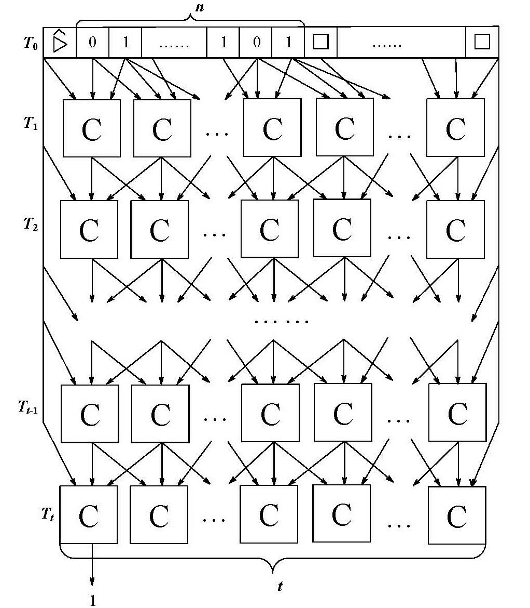

设L可被多项式NDTM$\mathbb N$判定。构造从L到SAT的隐式对数空间可计算的Cook-Levin规约。

## 定理4.6

一个语言L可被一致电路族接受，当且仅当$L\in\mathbf P$. 

电路族$\{C_n\}$是一致的，当且仅当存在一个将$1^n$映射到$C_n$编码的隐式对数空间可计算函数。

## 证明

证明$\Rightarrow$：

设L可被一致电路族接受。构造一DTM$\mathbb M$，当输入是x时，调用隐式对数空间可计算函数在多项式时间内产生一个多项式大小的电路$C_{n}$，然后在多项式时间完成$C_n(x)$的计算。因此$L\in\mathbf P$. 

证明$\Leftarrow$：

设只有一条读写带的$\mathbb M$在多项式时间t=T(n)内判定L. 

用$T_0,\cdots,T_t$表示$\mathbb M(x)$计算的格局序列，$T_i$包含了t+1个格子里的所有符号，$T_{ij}$表示$T_i$中第j个符号，其中$0\le j\le t+1$. 显然有$T_{i0}=\rhd$和$T_{i(t+1)}=\Box$. 

我们再将$T_{ij}$换为一个三元组(s, h, q)，其中s就是所指格子中的符号；h取布尔值，表示读写头是否指向该格；q是格局所处的状态。

第t+1个格局和第t个格局有如下的局部递推关系：$T_{ij}$可从$T_{(i-1)(j-1)},T_{(i-1)j},T_{(i-1)(j+1)}$中算出来，而且这个计算只依赖于$\mathbb M$，不依赖于输入x，这可以用同一个电路C实现，如图所示：

电路$C_{ij}$的输入是$C_{(i-1)(j-1)},C_{(i-1)j},C_{(i-1)(j+1)}$的输出。所有$C_{0j}$直接绑定为起始格局（的二进制编码）；所有的$C_{i0}$绑定为$\rhd$；所有$C_{i(t+1)}$绑定为$\Box$. 最终得到的电路可接受L中输入长度是n的串。可以用一个类似于深度优先遍历的算法将最终电路的邻接矩阵在对数空间里输出。

## 引理4.1

对所有$L\in\mathbf{NP}$，有$L\le_L\text{CKT-SAT}$. 

其中CKT-SAT是电路版本的可满足性问题，即所有那些可满足的电路的集合。$x\in\text{CKT-SAT}$当且仅当x是一个电路C的编码且
$$
\exists u\in\{0,1\}^n.C(u)=1
$$
其中n是C所接受的输入长度。

## 证明

设$L\in\mathbf{NP}$，则存在多项式p与DTM$\mathbb M$满足
$$
x\in L\Leftrightarrow\exists u\in\{0,1\}^{p(|x|)}.\mathbb M(x,u)=1
$$
用定理4.6将$\mathbb M(x,u)$在对数空间规约到计算$\mathbb M(x,u)$的电路C，然后将输入x和C做硬链接。这给出了从L到CKT-SAT的对数规约。

## 引理4.2

$\text{CKT-SAT}\le_L\text{SAT}$. 

## 证明

设C为输入电路。为C的每个输入、每个门、每个输出引入一个布尔变量。输入的C包含了所有门的输入编码和输出编码，可将这些编码作为相应变量的编码。若一个与门的输入为x, y，输出为z，即满足布尔公式$z=x\wedge y$，这可等价转换为合取范式：
$$
\begin{align}
z\Leftrightarrow x\wedge y&=(z\vee\overline{x\wedge y})\wedge(\overline z\vee(x\wedge y))\\
&=(z\vee\overline x\vee\overline y)\wedge(\overline z\vee x)\wedge(\overline z\vee y)
\end{align}
$$
或门和非门也同样可用合取范式表示。这些合取范式的大小是对数长的，可逐个输出。